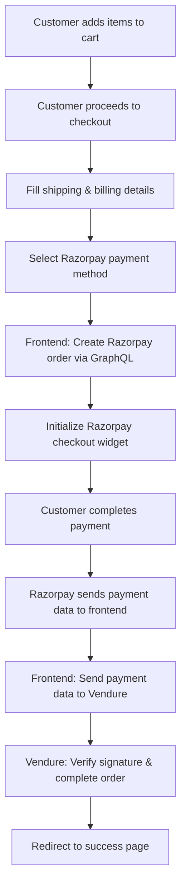

# Frontend Razorpay Checkout Integration Guide

## Overview

This guide explains how to implement Razorpay checkout in your frontend storefront to work with your existing Vendure backend integration.

## Prerequisites

- ✅ Vendure backend with Razorpay integration (already working)
- ✅ RazorpayGraphQLPlugin enabled
- ✅ Frontend storefront (Next.js/React/Vue/etc.)
- ✅ Razorpay credentials configured

## Checkout Flow Architecture



## Step-by-Step Implementation

### 1. Install Razorpay SDK

```bash
# For React/Next.js
npm install razorpay

# Include Razorpay script in your HTML (alternative)
<script src="https://checkout.razorpay.com/v1/checkout.js"></script>
```

### 2. Create Razorpay Service

```typescript
// services/razorpay.service.ts
import { GraphQLClient } from 'graphql-request';

const graphqlClient = new GraphQLClient('/shop-api', {
  credentials: 'include', // Important for session cookies
});

export interface RazorpayOrder {
  id: string;
  amount: number;
  currency: string;
  key: string;
  receipt?: string;
}

export class RazorpayService {
  /**
   * Create Razorpay order using Vendure GraphQL API
   */
  static async createOrder(): Promise<RazorpayOrder> {
    const mutation = `
      mutation CreateRazorpayOrder {
        createRazorpayOrder {
          id
          amount
          currency
          key
          receipt
        }
      }
    `;

    try {
      const response = await graphqlClient.request(mutation);
      return response.createRazorpayOrder;
    } catch (error) {
      console.error('Failed to create Razorpay order:', error);
      throw new Error('Unable to initialize payment. Please try again.');
    }
  }

  /**
   * Add payment to Vendure order
   */
  static async addPaymentToOrder(paymentData: {
    razorpay_order_id: string;
    razorpay_payment_id: string;
    razorpay_signature: string;
  }) {
    const mutation = `
      mutation AddPaymentToOrder($input: PaymentInput!) {
        addPaymentToOrder(input: $input) {
          __typename
          ... on Order {
            id
            code
            state
            totalWithTax
            payments {
              id
              state
              amount
              transactionId
            }
          }
          ... on OrderPaymentStateError {
            errorCode
            message
          }
          ... on PaymentFailedError {
            errorCode
            message
            paymentErrorMessage
          }
          ... on PaymentDeclinedError {
            errorCode
            message
            paymentErrorMessage
          }
          ... on OrderStateTransitionError {
            errorCode
            message
            transitionError
          }
        }
      }
    `;

    try {
      const response = await graphqlClient.request(mutation, {
        input: {
          method: 'razorpay',
          metadata: paymentData,
        },
      });

      return response.addPaymentToOrder;
    } catch (error) {
      console.error('Failed to add payment to order:', error);
      throw new Error('Payment verification failed. Please contact support.');
    }
  }
}
```

### 3. Checkout Component

```typescript
// components/RazorpayCheckout.tsx
import React, { useState } from 'react';
import { RazorpayService } from '../services/razorpay.service';

declare global {
  interface Window {
    Razorpay: any;
  }
}

interface CheckoutProps {
  order: {
    id: string;
    code: string;
    totalWithTax: number;
    customer?: {
      firstName: string;
      lastName: string;
      emailAddress: string;
      phoneNumber?: string;
    };
  };
  onSuccess: (orderId: string) => void;
  onError: (error: string) => void;
}

export const RazorpayCheckout: React.FC<CheckoutProps> = ({
  order,
  onSuccess,
  onError,
}) => {
  const [isLoading, setIsLoading] = useState(false);

  const handlePayment = async () => {
    setIsLoading(true);

    try {
      // Step 1: Create Razorpay order
      const razorpayOrder = await RazorpayService.createOrder();

      // Step 2: Initialize Razorpay checkout
      const options = {
        key: razorpayOrder.key,
        amount: razorpayOrder.amount,
        currency: razorpayOrder.currency,
        order_id: razorpayOrder.id,
        name: 'YouniqueIndia',
        description: `Order ${order.code}`,
        image: '/logo.png', // Your logo
        
        // Customer details (prefill)
        prefill: {
          name: order.customer 
            ? `${order.customer.firstName} ${order.customer.lastName}`
            : '',
          email: order.customer?.emailAddress || '',
          contact: order.customer?.phoneNumber || '',
        },

        // Theme
        theme: {
          color: '#3399cc', // Your brand color
        },

        // Payment success handler
        handler: async function (response: any) {
          try {
            // Step 3: Send payment data to Vendure
            const result = await RazorpayService.addPaymentToOrder({
              razorpay_order_id: response.razorpay_order_id,
              razorpay_payment_id: response.razorpay_payment_id,
              razorpay_signature: response.razorpay_signature,
            });

            if (result.__typename === 'Order') {
              onSuccess(result.id);
            } else {
              onError(result.message || 'Payment verification failed');
            }
          } catch (error: any) {
            onError(error.message);
          }
        },

        // Payment failure/cancellation handler
        modal: {
          ondismiss: function () {
            onError('Payment cancelled');
            setIsLoading(false);
          },
        },
      };

      // Open Razorpay checkout
      const rzp = new window.Razorpay(options);
      rzp.open();

    } catch (error: any) {
      onError(error.message);
      setIsLoading(false);
    }
  };

  return (
    <div className="razorpay-checkout">
      <button
        onClick={handlePayment}
        disabled={isLoading}
        className="pay-button"
      >
        {isLoading ? 'Processing...' : `Pay ₹${(order.totalWithTax / 100).toFixed(2)}`}
      </button>
    </div>
  );
};
```

### 4. Checkout Page Implementation

```typescript
// pages/checkout.tsx (Next.js example)
import React, { useState, useEffect } from 'react';
import { useRouter } from 'next/router';
import Head from 'next/head';
import { RazorpayCheckout } from '../components/RazorpayCheckout';

export default function CheckoutPage() {
  const router = useRouter();
  const [order, setOrder] = useState(null);
  const [loading, setLoading] = useState(true);
  const [error, setError] = useState('');

  // Load active order on component mount
  useEffect(() => {
    loadActiveOrder();
  }, []);

  const loadActiveOrder = async () => {
    try {
      const query = `
        query GetActiveOrder {
          activeOrder {
            id
            code
            state
            totalWithTax
            customer {
              firstName
              lastName
              emailAddress
              phoneNumber
            }
            lines {
              id
              quantity
              productVariant {
                name
                price
              }
            }
          }
        }
      `;

      const response = await fetch('/shop-api', {
        method: 'POST',
        headers: { 'Content-Type': 'application/json' },
        credentials: 'include',
        body: JSON.stringify({ query }),
      });

      const data = await response.json();
      
      if (data.data.activeOrder) {
        setOrder(data.data.activeOrder);
      } else {
        setError('No active order found. Please add items to cart.');
      }
    } catch (err) {
      setError('Failed to load order details.');
    } finally {
      setLoading(false);
    }
  };

  const handlePaymentSuccess = (orderId: string) => {
    // Redirect to success page
    router.push(`/order-success?orderId=${orderId}`);
  };

  const handlePaymentError = (errorMessage: string) => {
    setError(errorMessage);
  };

  if (loading) return <div>Loading checkout...</div>;
  if (error) return <div className="error">Error: {error}</div>;
  if (!order) return <div>No order found</div>;

  return (
    <>
      <Head>
        <title>Checkout - YouniqueIndia</title>
        <script src="https://checkout.razorpay.com/v1/checkout.js"></script>
      </Head>

      <div className="checkout-page">
        <h1>Checkout</h1>
        
        {/* Order Summary */}
        <div className="order-summary">
          <h2>Order Summary</h2>
          <p>Order: {order.code}</p>
          <p>Total: ₹{(order.totalWithTax / 100).toFixed(2)}</p>
          
          {/* Order items */}
          <div className="order-items">
            {order.lines.map((line) => (
              <div key={line.id} className="order-item">
                <span>{line.productVariant.name}</span>
                <span>Qty: {line.quantity}</span>
                <span>₹{(line.productVariant.price / 100).toFixed(2)}</span>
              </div>
            ))}
          </div>
        </div>

        {/* Payment Section */}
        <div className="payment-section">
          <h2>Payment</h2>
          {error && <div className="error">{error}</div>}
          
          <RazorpayCheckout
            order={order}
            onSuccess={handlePaymentSuccess}
            onError={handlePaymentError}
          />
        </div>
      </div>
    </>
  );
}
```

### 5. Success Page

```typescript
// pages/order-success.tsx
import React, { useEffect, useState } from 'react';
import { useRouter } from 'next/router';

export default function OrderSuccessPage() {
  const router = useRouter();
  const [order, setOrder] = useState(null);
  const { orderId } = router.query;

  useEffect(() => {
    if (orderId) {
      loadOrderDetails(orderId as string);
    }
  }, [orderId]);

  const loadOrderDetails = async (id: string) => {
    try {
      const query = `
        query GetOrder($id: ID!) {
          order(id: $id) {
            id
            code
            state
            totalWithTax
            payments {
              id
              state
              amount
              transactionId
            }
          }
        }
      `;

      const response = await fetch('/shop-api', {
        method: 'POST',
        headers: { 'Content-Type': 'application/json' },
        body: JSON.stringify({
          query,
          variables: { id },
        }),
      });

      const data = await response.json();
      setOrder(data.data.order);
    } catch (error) {
      console.error('Failed to load order:', error);
    }
  };

  return (
    <div className="success-page">
      <h1>🎉 Payment Successful!</h1>
      
      {order && (
        <div className="order-details">
          <p>Order ID: {order.code}</p>
          <p>Amount: ₹{(order.totalWithTax / 100).toFixed(2)}</p>
          <p>Status: {order.state}</p>
          
          {order.payments.map((payment) => (
            <div key={payment.id}>
              <p>Payment ID: {payment.transactionId}</p>
            </div>
          ))}
        </div>
      )}

      <button onClick={() => router.push('/')}>
        Continue Shopping
      </button>
    </div>
  );
}
```

## Important Notes

### 1. Security
- ✅ Payment verification happens on your secure backend
- ✅ Razorpay signatures are verified server-side
- ✅ Never expose your Razorpay secret key in frontend

### 2. Error Handling
- Handle network failures gracefully
- Provide clear error messages to users
- Log errors for debugging

### 3. Testing
```typescript
// Test mode credentials (use in development)
RAZORPAY_KEY_ID=rzp_test_xxxxxxxxxx
RAZORPAY_KEY_SECRET=xxxxxxxxxxxxxxxxxx

// Production credentials (use in production)
RAZORPAY_KEY_ID=rzp_live_xxxxxxxxxx
RAZORPAY_KEY_SECRET=xxxxxxxxxxxxxxxxxx
```

### 4. Mobile Responsiveness
- Razorpay checkout is mobile-optimized by default
- Test on different devices and screen sizes

## Common Issues & Solutions

### Issue: "No active order found"
**Solution**: Ensure user has items in cart and is properly authenticated

### Issue: Payment verification fails
**Solution**: Check that all three Razorpay response fields are being sent to backend

### Issue: CORS errors
**Solution**: Ensure your backend CORS configuration allows your frontend domain

### Issue: GraphQL mutation not found
**Solution**: Verify RazorpayGraphQLPlugin is added to your Vendure configuration

## Testing Checklist

- [ ] Order creation works
- [ ] Razorpay checkout opens correctly
- [ ] Test payment succeeds
- [ ] Payment verification works
- [ ] Order status updates correctly
- [ ] Success page displays properly
- [ ] Error handling works
- [ ] Mobile experience is good

## Production Deployment

1. **Switch to live Razorpay keys**
2. **Test with small amounts first**
3. **Monitor payment success rates**
4. **Set up webhook notifications (optional)**
5. **Enable payment analytics**

Your Razorpay integration is now complete! 🎉
